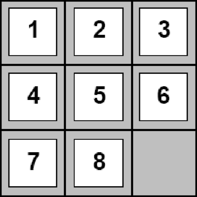

# 8 pieces puzzle game

the goal is to rearrange the pieces of the board to the correct order by clicking on pieces next to the blank square. You can press `q` to quit or `r` to restart the puzzle. 

Made with **[LÖVE](https://love2d.org/)**

### Goal

### Play on Windows

Download the game [zip](https://drive.google.com/file/d/15TwE5muHJjsNPEfKoJOum1rgEF06aVBe/view?usp=sharing) file and open the 8-puzzle.exe file. Please don't delete the .dll files, the game will not work without them.

### Play on Linux and MacOS

First install **[LÖVE](https://love2d.org/)** framework

Download and execute the file [8.love](https://drive.google.com/file/d/1wDMGUQDBam0xyaMCbU--RCglt1uHnnZq/view?usp=sharing)
 
Or run this commands:

`git clone https://github.com/yanbentes/8.git`
 
run love framework
 
`love 8/`
