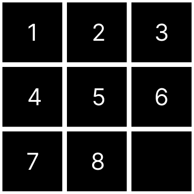

# 8 pieces puzzle game

the goal is to rearrange the pieces of the board to the correct order by clicking on pieces next to the blank square. You can press `q` to quit or `r` to restart the puzzle.

Made with **[LÖVE](https://love2d.org/)**

### Goal

### Play on Windows

Download the game [8puzzle.zip](https://drive.google.com/file/d/1T0Iu_xcWoubLXKwlxH0bqZNHVbga3F24/view?usp=sharing) file and open the 8-puzzle.exe file. Please don't delete the *.dll* files.

### Play on Linux and MacOS

First install **[LÖVE](https://love2d.org/)** framework. Download and execute the file [8puzzle.love](https://drive.google.com/file/d/1XCTubHVAD_d8_cX7mAKSODSwKzk-ZdQq/view?usp=sharing) or clone the repo

`git clone https://github.com/yanbentes/8.git`
 
open a terminal window and run the love2d framework
 
`love 8/`
